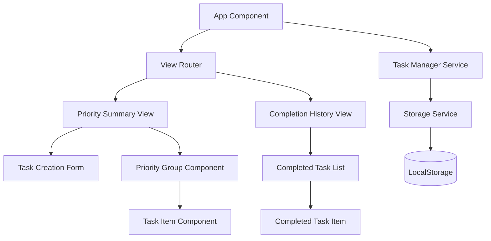

# Design Document: Task Management Web Application

## Overview

This design document specifies the technical architecture and implementation approach for a task management web application. The system enables users to create, track, and manage tasks with associated metadata including descriptions, priority levels, and completion dates.

The application provides two primary interfaces:
1. **Priority Summary View**: Displays open tasks grouped by priority (High, Medium, Low)
2. **Completion History View**: Displays completed tasks ordered by completion date (most recent first)

### Technology Stack

Given the requirements for a web-based application with browser storage and responsive UI, the following technology stack is recommended:

- **Frontend Framework**: React with TypeScript for type safety and component-based architecture
- **State Management**: React Context API for simple state management across views
- **Storage**: Browser LocalStorage API for client-side data persistence
- **Styling**: CSS Modules or Tailwind CSS for responsive design
- **Build Tool**: Vite for fast development and optimized production builds
- **Testing**: Vitest for unit tests, fast-check for property-based testing

### Key Design Principles

1. **Client-Side Architecture**: All data storage and processing occurs in the browser
2. **Type Safety**: TypeScript ensures compile-time validation of data structures
3. **Separation of Concerns**: Clear boundaries between data layer, business logic, and UI
4. **Testability**: Design enables both unit testing and property-based testing
5. **Responsive Design**: UI adapts to different screen sizes and devices

## Architecture

### System Architecture

The application follows a layered architecture pattern:

```
┌─────────────────────────────────────────┐
│         Presentation Layer              │
│  (React Components + View Logic)        │
├─────────────────────────────────────────┤
│         Application Layer               │
│  (Task Management Business Logic)       │
├─────────────────────────────────────────┤
│         Data Access Layer               │
│  (LocalStorage Abstraction)             │
├─────────────────────────────────────────┤
│         Storage Layer                   │
│  (Browser LocalStorage)                 │
└─────────────────────────────────────────┘
```

### Component Architecture



### Data Flow

1. **Task Creation Flow**:
   - User inputs description and priority in TaskForm
   - TaskForm validates input and calls TaskManager.createTask()
   - TaskManager generates unique ID, creates Task object
   - TaskManager persists to Storage
   - UI updates to reflect new task

2. **Task Completion Flow**:
   - User clicks complete button on TaskItem
   - TaskItem calls TaskManager.completeTask(taskId)
   - TaskManager updates task with completion date
   - TaskManager persists updated task to Storage
   - UI updates to remove task from Priority Summary View

3. **View Navigation Flow**:
   - User clicks navigation control
   - Router updates active view
   - New view component loads and fetches data from TaskManager
   - TaskManager retrieves data from Storage
   - View renders with current data

## Components and Interfaces

### Core Services

#### TaskManager Service

The TaskManager service encapsulates all business logic for task operations.

```typescript
interface TaskManager {
  // Task operations
  createTask(description: string, priority: Priority): Task;
  completeTask(taskId: string): void;
  getTask(taskId: string): Task | undefined;
  
  // Query operations
  getOpenTasks(): Task[];
  getCompletedTasks(): Task[];
  getTasksByPriority(priority: Priority): Task[];
  
  // View-specific queries
  getOpenTasksGroupedByPriority(): PriorityGroups;
  getCompletedTasksSortedByDate(): Task[];
}
```

#### Storage Service

The Storage service abstracts LocalStorage operations and handles serialization.

```typescript
interface StorageService {
  // CRUD operations
  saveTask(task: Task): void;
  loadTask(taskId: string): Task | undefined;
  loadAllTasks(): Task[];
  deleteTask(taskId: string): void;
  
  // Batch operations
  saveAllTasks(tasks: Task[]): void;
  
  // Utility
  clear(): void;
}
```

### React Components

#### App Component

Root component that manages routing and global state.

```typescript
interface AppProps {}

interface AppState {
  currentView: 'priority' | 'history';
  taskManager: TaskManager;
}
```

#### TaskForm Component

Form for creating new tasks with validation.

```typescript
interface TaskFormProps {
  onTaskCreated: (task: Task) => void;
}

interface TaskFormState {
  description: string;
  priority: Priority | null;
  errors: ValidationErrors;
}
```

#### PrioritySummaryView Component

Displays open tasks grouped by priority.

```typescript
interface PrioritySummaryViewProps {
  taskManager: TaskManager;
  onTaskComplete: (taskId: string) => void;
}
```

#### CompletionHistoryView Component

Displays completed tasks ordered by completion date.

```typescript
interface CompletionHistoryViewProps {
  taskManager: TaskManager;
}
```

#### TaskItem Component

Displays individual task with completion action.

```typescript
interface TaskItemProps {
  task: Task;
  onComplete: (taskId: string) => void;
}
```

#### CompletedTaskItem Component

Displays completed task with all metadata.

```typescript
interface CompletedTaskItemProps {
  task: Task;
}
```

## Data Models

### Task Model

The core data structure representing a task.

```typescript
type Priority = 'High' | 'Medium' | 'Low';

interface Task {
  id: string;                    // Unique identifier (UUID v4)
  description: string;           // Task description (1-500 chars)
  priority: Priority;            // Priority level
  completionDate: Date | null;   // null for open tasks, Date for completed
  createdAt: Date;              // Creation timestamp
}
```

### Validation Rules

- **description**: Required, 1-500 characters, non-empty after trimming
- **priority**: Required, must be one of: 'High', 'Medium', 'Low'
- **id**: Auto-generated UUID v4, immutable
- **completionDate**: null for open tasks, valid Date object for completed tasks
- **createdAt**: Auto-generated on creation, immutable

### Storage Format

Tasks are stored in LocalStorage as a JSON array under the key `tasks`:

```json
{
  "tasks": [
    {
      "id": "550e8400-e29b-41d4-a716-446655440000",
      "description": "Implement user authentication",
      "priority": "High",
      "completionDate": null,
      "createdAt": "2024-01-15T10:30:00.000Z"
    },
    {
      "id": "6ba7b810-9dad-11d1-80b4-00c04fd430c8",
      "description": "Write unit tests",
      "priority": "Medium",
      "completionDate": "2024-01-16T14:20:00.000Z",
      "createdAt": "2024-01-15T11:00:00.000Z"
    }
  ]
}
```

### Derived Data Structures

#### PriorityGroups

Used for organizing tasks in Priority Summary View:

```typescript
interface PriorityGroups {
  High: Task[];
  Medium: Task[];
  Low: Task[];
}
```

#### ValidationErrors

Used for form validation feedback:

```typescript
interface ValidationErrors {
  description?: string;
  priority?: string;
}
```


## Correctness Properties

*A property is a characteristic or behavior that should hold true across all valid executions of a system—essentially, a formal statement about what the system should do. Properties serve as the bridge between human-readable specifications and machine-verifiable correctness guarantees.*

### Property 1: Task ID Uniqueness

*For any* sequence of task creation operations, all generated task IDs must be unique across the entire sequence.

**Validates: Requirements 1.3**

### Property 2: New Tasks Are Open

*For any* newly created task with valid description and priority, the task's completionDate field must be null, indicating it is an open task.

**Validates: Requirements 1.4**

### Property 3: Storage Round-Trip Preservation

*For any* task (whether open or completed), serializing the task to storage and then deserializing it must produce a task equivalent to the original, preserving all fields: id, description, priority, completionDate, and createdAt.

**Validates: Requirements 1.5, 2.1, 2.2, 2.3, 2.4, 2.5, 3.3**

### Property 4: Task Completion Sets Valid Date

*For any* open task, when the task is marked as complete, the resulting task must have a non-null completionDate field containing a valid Date object representing the time of completion.

**Validates: Requirements 3.1, 3.2**

### Property 5: Priority View Filters Open Tasks

*For any* collection of tasks containing both open and completed tasks, the Priority Summary View must display only those tasks where completionDate is null.

**Validates: Requirements 4.2**

### Property 6: Priority View Groups Correctly

*For any* collection of open tasks, the Priority Summary View must group tasks such that each task appears in exactly one priority group matching its priority field, and each displayed task shows its id and description.

**Validates: Requirements 4.3, 4.4**

### Property 7: Priority View Ordering

*For any* Priority Summary View output, High priority tasks must appear before Medium priority tasks, and Medium priority tasks must appear before Low priority tasks in the rendered output.

**Validates: Requirements 4.5, 4.6**

### Property 8: Completion View Filters Completed Tasks

*For any* collection of tasks containing both open and completed tasks, the Completion History View must display only those tasks where completionDate is not null.

**Validates: Requirements 5.2**

### Property 9: Completion View Ordering

*For any* collection of completed tasks, the Completion History View must order tasks by completionDate in descending order (most recent first).

**Validates: Requirements 5.3**

### Property 10: Completion View Displays All Fields

*For any* completed task displayed in the Completion History View, the rendered output must contain the task's id, description, priority, and completionDate.

**Validates: Requirements 5.4**

### Property 11: View Navigation Preserves Data

*For any* task collection and any sequence of view navigation operations (switching between Priority Summary View and Completion History View), the task data must remain unchanged—no tasks are added, removed, or modified by navigation alone.

**Validates: Requirements 6.3**

### Property 12: Valid Descriptions Accepted

*For any* string with length between 1 and 500 characters (after trimming whitespace) and a valid priority, creating a task with that description must succeed without error.

**Validates: Requirements 7.3**

### Property 13: Invalid Descriptions Rejected

*For any* string with length exceeding 500 characters, attempting to create a task with that description must fail with an appropriate error message and must not create a task.

**Validates: Requirements 7.4**

## Error Handling

### Validation Errors

The system must validate user input and provide clear error messages:

1. **Empty Description**: 
   - Trigger: User submits task form with empty or whitespace-only description
   - Response: Display error "Task description is required" and prevent task creation
   - Validation: Requirements 7.1

2. **Missing Priority**:
   - Trigger: User submits task form without selecting a priority
   - Response: Display error "Priority selection is required" and prevent task creation
   - Validation: Requirements 7.2

3. **Description Too Long**:
   - Trigger: User enters description exceeding 500 characters
   - Response: Display error "Description must not exceed 500 characters (current: X)" and prevent task creation
   - Validation: Requirements 7.4

### Storage Errors

The system must handle LocalStorage failures gracefully:

1. **Storage Quota Exceeded**:
   - Trigger: LocalStorage quota is full
   - Response: Display error "Unable to save task: storage quota exceeded. Please delete some completed tasks."
   - Fallback: Maintain in-memory state for current session

2. **Storage Unavailable**:
   - Trigger: LocalStorage is disabled or unavailable
   - Response: Display warning "Persistent storage unavailable. Tasks will be lost on page refresh."
   - Fallback: Use in-memory storage for current session

3. **Corrupted Storage Data**:
   - Trigger: Invalid JSON or malformed data in LocalStorage
   - Response: Log error to console, clear corrupted data, start with empty task list
   - User Notification: "Storage data was corrupted and has been reset"

### Runtime Errors

1. **Invalid Task ID**:
   - Trigger: Attempt to complete or retrieve task with non-existent ID
   - Response: Log warning, return undefined or throw TaskNotFoundError
   - UI Handling: Display "Task not found" message

2. **Date Parsing Errors**:
   - Trigger: Invalid date format in stored data
   - Response: Use current date as fallback, log warning
   - Prevention: Always use ISO 8601 format for date serialization

## Testing Strategy

### Dual Testing Approach

The testing strategy employs both unit testing and property-based testing to ensure comprehensive coverage:

- **Unit Tests**: Verify specific examples, edge cases, error conditions, and integration points
- **Property Tests**: Verify universal properties across all inputs through randomized testing

Both approaches are complementary and necessary. Unit tests catch concrete bugs and validate specific scenarios, while property tests verify general correctness across a wide input space.

### Property-Based Testing

**Library**: fast-check (JavaScript/TypeScript property-based testing library)

**Configuration**:
- Minimum 100 iterations per property test (due to randomization)
- Each property test must reference its design document property using a comment tag
- Tag format: `// Feature: task-management-web-app, Property {number}: {property_text}`

**Property Test Coverage**:

Each of the 13 correctness properties defined in this document must be implemented as a single property-based test:

1. Property 1: Generate multiple tasks, verify all IDs are unique
2. Property 2: Generate random valid tasks, verify completionDate is null
3. Property 3: Generate random tasks, serialize/deserialize, verify equality
4. Property 4: Generate random open tasks, complete them, verify completionDate is set
5. Property 5: Generate mixed task lists, verify Priority View shows only open tasks
6. Property 6: Generate random open tasks, verify correct grouping by priority
7. Property 7: Generate random task lists, verify priority ordering in output
8. Property 8: Generate mixed task lists, verify Completion View shows only completed tasks
9. Property 9: Generate random completed tasks, verify descending date order
10. Property 10: Generate random completed tasks, verify all fields in output
11. Property 11: Generate random task lists, perform view navigation, verify data unchanged
12. Property 12: Generate random valid descriptions (1-500 chars), verify acceptance
13. Property 13: Generate random invalid descriptions (>500 chars), verify rejection

**Generators**:

The following custom generators should be implemented for fast-check:

```typescript
// Generate valid task descriptions (1-500 characters)
const validDescriptionArb = fc.string({ minLength: 1, maxLength: 500 });

// Generate invalid task descriptions (>500 characters)
const invalidDescriptionArb = fc.string({ minLength: 501, maxLength: 1000 });

// Generate priority values
const priorityArb = fc.constantFrom('High', 'Medium', 'Low');

// Generate open tasks
const openTaskArb = fc.record({
  id: fc.uuid(),
  description: validDescriptionArb,
  priority: priorityArb,
  completionDate: fc.constant(null),
  createdAt: fc.date()
});

// Generate completed tasks
const completedTaskArb = fc.record({
  id: fc.uuid(),
  description: validDescriptionArb,
  priority: priorityArb,
  completionDate: fc.date(),
  createdAt: fc.date()
});

// Generate mixed task lists
const taskListArb = fc.array(
  fc.oneof(openTaskArb, completedTaskArb),
  { minLength: 0, maxLength: 50 }
);
```

### Unit Testing

**Library**: Vitest (fast unit testing framework for Vite projects)

**Unit Test Focus Areas**:

1. **Specific Examples**:
   - Create task with specific description and priority
   - Complete specific task and verify state change
   - Load application and verify default view is Priority Summary

2. **Edge Cases**:
   - Empty task list displays appropriate message
   - Priority group with no tasks displays empty indicator
   - Completion history with no completed tasks displays empty message
   - Task with exactly 500 characters is accepted
   - Task with exactly 501 characters is rejected

3. **Error Conditions**:
   - Empty description triggers validation error (Requirement 7.1)
   - Missing priority triggers validation error (Requirement 7.2)
   - Storage quota exceeded handled gracefully
   - Corrupted storage data handled gracefully

4. **Integration Points**:
   - TaskManager integrates correctly with StorageService
   - React components correctly call TaskManager methods
   - View navigation updates UI correctly
   - Form submission triggers task creation

5. **Component Rendering**:
   - TaskForm renders with correct initial state
   - PrioritySummaryView renders priority groups correctly
   - CompletionHistoryView renders completed tasks correctly
   - Navigation controls render and respond to clicks

**Test Organization**:

```
tests/
├── unit/
│   ├── services/
│   │   ├── TaskManager.test.ts
│   │   └── StorageService.test.ts
│   ├── components/
│   │   ├── TaskForm.test.tsx
│   │   ├── PrioritySummaryView.test.tsx
│   │   ├── CompletionHistoryView.test.tsx
│   │   └── TaskItem.test.tsx
│   └── integration/
│       └── TaskFlow.test.tsx
└── property/
    ├── TaskManager.property.test.ts
    ├── PrioritySummaryView.property.test.ts
    └── CompletionHistoryView.property.test.ts
```

### Test Coverage Goals

- **Line Coverage**: Minimum 90%
- **Branch Coverage**: Minimum 85%
- **Property Test Iterations**: Minimum 100 per property
- **Critical Paths**: 100% coverage for task creation, completion, and persistence flows

### Browser Compatibility Testing

Manual testing required for:
- Chrome (latest 2 versions)
- Firefox (latest 2 versions)
- Safari (latest 2 versions)
- Edge (latest 2 versions)

Test scenarios:
- Task creation and completion workflow
- View navigation
- LocalStorage persistence across page reloads
- Responsive design at different viewport sizes
- Form validation and error messages

